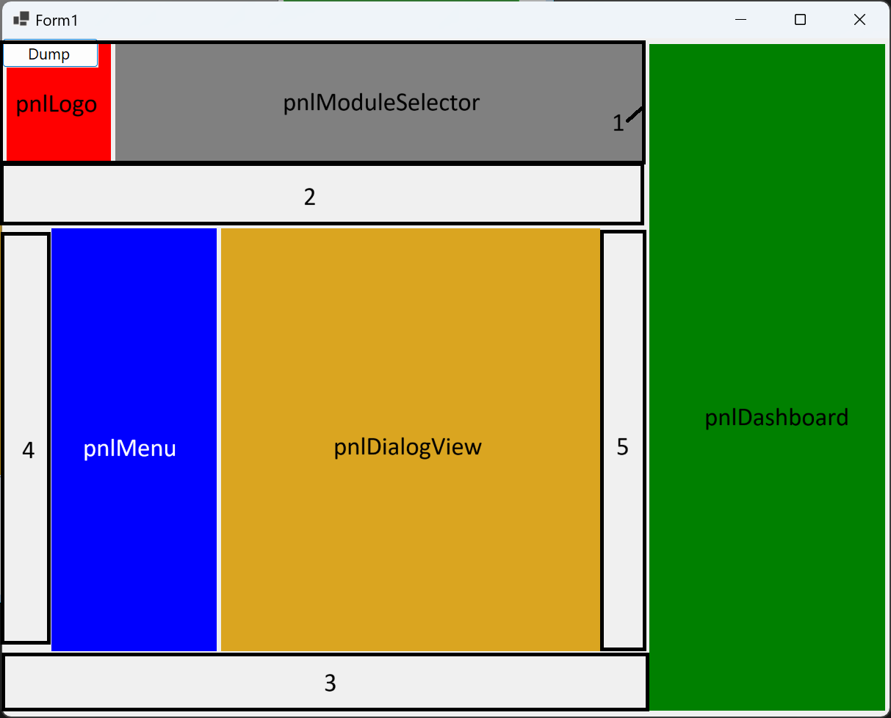

# Layout engine for Windows Forms applications

This is a layout engine for WinForms applications, which took
inspirations from the following sources:

- [WPF Grid](https://learn.microsoft.com/en-us/dotnet/api/system.windows.controls.grid)
- [ETS Layout](https://www.codeproject.com/articles/116/layout-manager-for-dialogs-formviews-dialogbars-an)

# Example

This is the dialog we'd like to layout:



## Requirements

- "pnlLogo" must always be at the left top position
- "pnlModuleSelector" must fill the space between the logo and the "pnlDashboard"
- "pnlMenu" and "pnlDialogView" must always stay together
- "pnlMenu" and "pnlDialogView" must always be in the center of the remaining space

## Solution

We use panes to group together the various controls/panes.

- We always need to create a root pane with a horizontal layout
- The root pane is split into two sub-panes
    - The pane for the space left to the dashboard
    - The pane for the dashboard
- The pane for the space left to the dashboard is split into four elements
    - The pane for the "pnlLogo" and the "pnlModuleSelector" (pane 1)
    - The pane to fill the gap between the header and the next pane to keep the next pane centered
    - The pane which contains the panes 4, 5, the "pnlMenu" and the "pnlDialogView"
    - Another pane to fill the gap between the bottom and the previous pane to keep the previous pane centered

## Code for the layout definition

```c#
_layoutRoot =
    (CreateRoot(this, Orientation.Horizontal)
    << (Pane(Orientation.Vertical).Width(Factor(1))
        << (Pane().HorizontalStackLayout(VerticalAlignment.Top)
            << Item(pnlLogo)
            << Item(pnlModuleSelector).Width(Factor(1)))
        << Item().Height(Factor(1))
        << (Pane().HorizontalStackLayout(VerticalAlignment.Center)
            << Item().Width(Factor(1))
            << Item(pnlMenu)
            << Item(pnlDialogView)
            << Item().Width(Factor(1)))
        << Item().Height(Factor(1)))
    << Item(pnlDashboard))
    .Build();
```

The functions `CreateRoot`, `Pane`, and `Item` are static functions in the static
 `FubarDev.LayoutEngine.BuilderMethods` class. I'm using a the `using static` C#
 feature to simplify the function calls:

 ```c#
 using static FubarDev.LayoutEngine.BuilderMethods;
 using static FubarDev.LayoutEngine.AttachedProperties.AttachedSize;
```

 This makes all static functions in the `BuilderMethods` class directly available.

### Line-by-line explanation

1. Store the built root pane into the variable `_layoutRoot`
2. The `CreateRoot` creates the root pane for the `Form` whose elements are aligned horizontally
3. A sub-pane is created for the space left to the "pnlDashboard"
    - The child elements are stacked vertically
    - The element should consume the whole remaining space (see "*" notation of the WPF grid for grid rows/columns)
4. A sub-pane is created for the header (pane 1)
    - The child elements are stacked horizontally
    - The default vertical alignment for the elements will be "top"
        - This causes the child elements to keep their height
5. Add the "pnlLogo" as first child element of the header pane (pane 1)
6. Add the "pnlModuleSelector" as the second child element which should use the remaining width of the header pane (pane 1)
7. Adds a spacer pane (pane 2)
8. Adds the pane containing the spacer panes 4 and 5, and the "pnlMenu" and "pnlDialogView"
    - All child elements should be centered vertically
9. Adds the spacer pane (pane 4)
    - This pane, together with pane 5 ensures that the "pnlMenu" and "pnlDialogView" are centered horizontally
    - The `.Width(AttachedSize.Factor(1))` on this pane and pane 5 causes the space
      not used by "pnlMenu" and "pnlDialogView" to be split equally between the panes 4 and 5.
10. Adds the "pnlMenu"
11. Adds the "pnlDialogView"
12. Adds the spacer pane (pane 5)
13. Adds the spacer pane (pane 3)
14. Adds the "pnlDashboard"

Using `Orientation.Horizontal` for a pane results in the child elements
being stretched to the full height of the surrounding pane. This behavior
can be changed by omitting the `Orientation.Horizontal` and using the
method `.HorizontalStackLayout(VerticalAlignment.Top)` to provide a different
default vertical alignment.

## Example dump

This dump contains the names of all elements for a layout, together
with the calculated minimum size for the element.

```text
root: {X=467,Y=415,Width=1232,Height=988}, {Width=1086, Height=762}
 nonDashboardArea: {X=3,Y=4,Width=875,Height=916}, {Width=753, Height=754}
  headerArea: {X=3,Y=4,Width=875,Height=170}, {Width=154, Height=170}
   pnlLogo: {X=6,Y=8,Width=142,Height=162}, {Width=142, Height=162}
   pnlModuleSelector: {X=154,Y=8,Width=721,Height=162}, {Width=0, Height=162}
  spacerTop: {X=3,Y=174,Width=875,Height=81}, {Width=0, Height=0}
  mainArea: {X=3,Y=255,Width=875,Height=584}, {Width=753, Height=584}
   spacerLeft: {X=3,Y=547,Width=61,Height=0}, {Width=0, Height=0}
   pnlMenu: {X=67,Y=259,Width=225,Height=576}, {Width=225, Height=576}
   pnlDialogView: {X=298,Y=259,Width=516,Height=576}, {Width=516, Height=576}
   spacerRight: {X=817,Y=547,Width=61,Height=0}, {Width=0, Height=0}
  spacerBottom: {X=3,Y=839,Width=875,Height=81}, {Width=0, Height=0}
 pnlDashboard: {X=881,Y=8,Width=321,Height=908}, {Width=321, Height=0}
```

## Performing the layout

The layout won't be performed automatically, which is a design decision,
not a technical decision.

To perform the layout, you must explicitly execute the following code:

```c#
_layoutRoot.Layout();
```

## Setting the minimum size of a form

The minimum size of the form can only be calculated if the form (and thus all
its controls) are visible, which is the reason why you should put the following
code into the `VisibleChanged` event handler of the form:

```c#
var minSize = _layoutRoot.GetMinimumClientSize();
var borderSize = Size - ClientSize;
MinimumSize = minSize + borderSize;
```

# Advanced features

## Overlaps

It's possible to make elements overlap each other.

### Example

```c#
_layoutRoot =
    (CreateRoot(this, Orientation.Horizontal)
    << (Pane(Orientation.Vertical).Width(Factor(1))
        << (Pane().HorizontalStackLayout(VerticalAlignment.Top)
            << Item(pnlLogo)
            << Item(pnlModuleSelector).Width(Factor(1)))
        << Pane().Height(Factor(1)).Identifier("a"))
    << Item(pnlDashboard))
    .AddOverlap(
        "a",
        Pane(Orientation.Vertical)
        << Item().Height(Factor(1))
        << (Pane().HorizontalStackLayout(VerticalAlignment.Center)
            << Item().Width(Factor(1))
            << Item(pnlMenu)
            << Item(pnlDialogView)
            << Item().Width(Factor(1)))
        << Item().Height(Factor(1)))
    .Build();
```

As you might've noticed, there's now a new function to `Identifier`.
This adds an application-global identifier to the given layout element.
Items that overlap the items with the given `Identifier` may now
be overlapped with the other controls by calling the `AddOverlap`
function, which takes the identifier of the layout element to
be overlapped and the layout that will overlap the target
layout element.

You may specify more that one "overlap" for a given layout element.

The idea behind this is, that you may have two or more controls
that should take the same space in the form, but only one should be visible
at all times.
